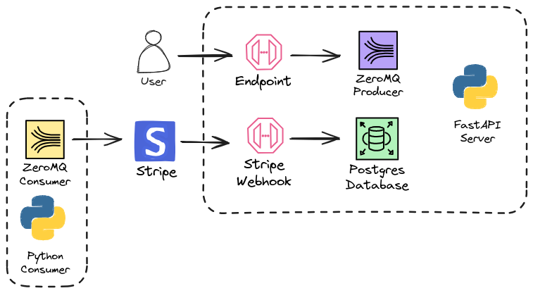

# Zenskar Task

See [PS.md](./PS.md) for the problem statement.

## Tech Stack

- Containerization: Docker
- Database: PostgreSQL (containerized)
- Backend: FastAPI (python)
- Queuing: ZeroMQ
- Webhook: Stripe
- TCP tunneling: ngrok
- Formatting: black
- Environment variables: python-dotenv

## Setup

0. Make sure you have docker and python (virtualenv) installed

1. Navigate to the directory, make a virtual python environment and install the requirements:

```sh
virtualenv venv
source venv/bin/activate
pip3 install -r requirements.txt
```

2. Create a `.env` file in the root of this directory, a sample one being given in the [`.env.sample`](./.env.sample) file. Get the Stripe api key. For getting the Stripe webhook secret, goto #7. Preferably, don't touch any environment variables starting with `PSQL_`. If you do, make sure to change the same in the [`postgres.docker.yaml`](./postgres.docker.yaml) file as well :p

3. Start the PostgreSQL database using docker:

```sh
docker compose -f postgres.docker.yaml up
```

4. Run the FastAPI server:

```sh
uvicorn server:app --reload
```

5. Start the ZeroMQ consumer:

```sh
python3 consumer.py
```

6. TCP tunneling via [ngrok](https://ngrok.com/):

```sh
ngrok http 8000
```

7. Copy the tunneled url from ngrok. Go to the [Stripe webhook dashboard](https://dashboard.stripe.com/test/webhooks) and add a new endpoint. Paste the copied ngrok url and add `/api/v1/endpoint/stripe` in front of it. Select `customer.created` event to listen to and add the endpoint. Grab the webhook secret and paste it in the `.env` file mentioned in #2 and then restart the FastAPI server.

## Operations

0. Make sure the server is running by sending a post request to `http://localhost:8000/api/v1/health`

1. Send a POST request to `http://localhost:8000/api/v1/task/create/customer`. A sample cURL command for the same is:

```sh
curl -X POST "http://127.0.0.1:8000/api/v1/task/create/customer" -H "accept: application/json" -H "Content-Type: application/json" -d '{"id": "489703215467608", "email": "adit@example.com", "name": "adit"}'
```

2. Alternatively, you can also [add a user on Stripe](https://dashboard.stripe.com/test/customers) directly. I'm using Stripe in testing mode.

## Flow

1. A post request to create a user is made
2. This queues a task in the ZeroMQ queue
3. The consumer listens to the queue and processes the task, creating the user on Stripe
4. Post successful creation, Stripe sends an event to the webhook
5. The created user is then stored in the PostgreSQL database



## Plan for integrating Salesforce

Similar to Stripe, a FastAPI endpoint (`/api/v1/task/create/invoice`) can be added for queuing the tasks for Salesforce as well, on its separate topic of course. The consumer can then listen to both the topics (operating on the same port) and process the tasks accordingly.

For more optimal performance, the consumer can be split into two separate consumers, each listening to their respective topics i.e. Stripe and Salesforce. This way, the consumer can be scaled horizontally as well.

Furthermore, the consumer listening logic can be abstracted into a separate module, which can be imported by the consumers for listening to the topics. This way, the consumer can be extended to listen to more topics in the future.

## Plan for integrating invoice catalogue

In the same way as the user data from Stripe's webhook callback is being stored, another table can be added to the PostgreSQL database for the invoice catalogue.

In the invoice catalogue, a column can be added, containing the customer id of the person in whose name the invoice is made, thus creating a relationship between the two tables.
